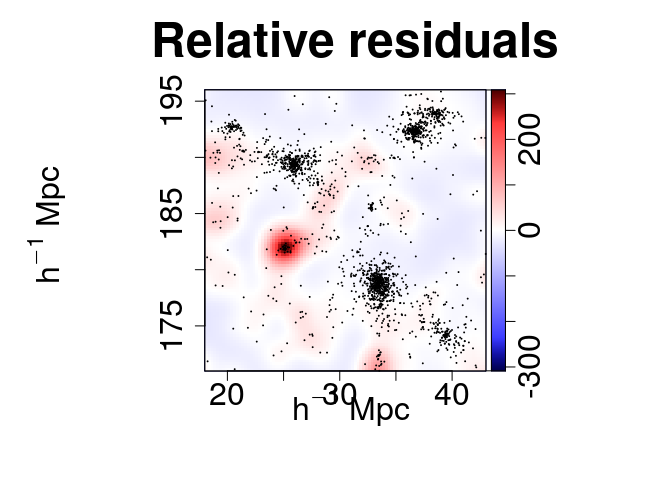
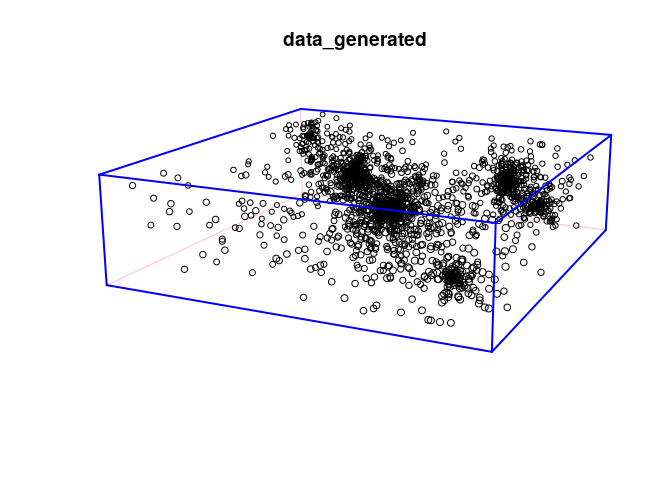

# Example of execution

In this notebook we reproduce the example presented in section 7 of the
publication: Ll. Hurtado-Gil et al., *Darkmix: Mixture Models for
Detection and Characterization of Dark Matter Halos*, submitted to ApJ

Used R packages and functions:

-   `spatstat` and `spatstat.utils`: `owin`, `pp3`, `unique`, `as.im`,
    `quadscheme`, `box3`, `variablesinformula` and `volume`
-   `plotrix`: `draw.circle`
-   `LaplacesDemon`: `Blocks` and `LaplacesDemon`
-   `expint`: `gamma` and `gammainc`
-   `misc3d`: `kde3d`
-   `Base R`: multiple functions (in particular the function `optim`)

## Step 1 – Setup

Load the necessary functions and packages.

    source("Code/darkmix.R")
    library(spatstat)
    library(spatstat.utils)
    library(expint)
    library(plotrix)
    library(misc3d)
    library(LaplacesDemon)

Read the data set to create the point process object and its quadrature:

    data <- read.table("Data/datacat.txt")
    minx <- 18; maxx <- 43; 
    miny <- 171; maxy <- 196; 
    minz <- 95; maxz <- 102;
    clust <- pp3(x=data[,2],y=data[,3],z=data[,4], box3(xrange=c(minx,maxx), yrange=c(miny,maxy), zrange=c(minz,maxz)))
    ntile <- c(50,50,14)
    ntile <- c(100,100,28)
    quad <- quad.3d(clust, ntile)

Declare a Finite Mixture Model of 10 cluster components plus background.
Use Einasto profile for the clusters:

    k <- 10
    v <- 5
    param2 <-c(k+1,rep(c(einasto.model,v),k), const.model,0)

## Step 2 – Initial guess

Initialize the parameters vector and generate an initial guess of the
cluster centers:

    param <- rep(0,k*(v+1))
    cent <- centers(clust, h=0.3, ntile=c(25,25,7), k)
    arg <- list(centers=cent[[1]], re=1, n=3, mix=1, back=-2)
    param <- mixture.model(param, param2, output=c(), action.initial, arg)
    param_df <- param2profile(param)

    ##       x     y     z re n mix
    ## 1  33.5 178.5  99.5  1 3   0
    ## 2  36.5 192.5  98.5  1 3   1
    ## 3  39.5 174.5  97.5  1 3   1
    ## 4  25.5 189.5  98.5  1 3   1
    ## 5  20.5 192.5 100.5  1 3   1
    ## 6  38.5 193.5  96.5  1 3   1
    ## 7  37.5 175.5  99.5  1 3   1
    ## 8  33.5 172.5 100.5  1 3   1
    ## 9  32.5 185.5  99.5  1 3   1
    ## 10 21.5 190.5  98.5  1 3   1
    ## Background mix: -2

The initial guess can be visualized:

    arg = list(mar=c(0,0,0,0), clust=clust, col=2, pch=16,border=2, cex=0.5, cexl=2, lwd=2)
    out <- mixture.model(param, param2, output = NULL, action.draw, arg)

## Step 3 – Likelihood maximization

Optimize the parameters via the Nelder-Mead algorithm, and save the
result.

    ocf <- optim(param, model.lik, param2=param2, model=mixture.model, clust=clust, quad=quad, all=FALSE); 
    param <- ocf$par

For further model refinement we can use the `mask.freeze` functions.

    param <- mask.freeze(param, param2, mask.adjust_positions(k,v), clust, quad)
    param <- mask.freeze(param, param2, mask.adjust_radii(k,v), clust, quad)
    param <- mask.freeze(param, param2, mask.adjust_sersic(k,v), clust, quad)
    param <- mask.freeze(param, param2, mask.adjust_mix(k,v), clust, quad)

The maximum likelihood, AIC and BIC can be calculated with

    aic_bic <- AIC.BIC(param, param2, clust, quad)

    ## [1] "Maximum log-likelihood: 1348.04614787798"
    ## [1] "AIC: -2576.09229575595"
    ## [1] "BIC: -2237.65606617234"

However, the resulting parameters are still far from the best fit.
Repeat the previous steps to obtain better results. In the following
steps we present the results with the already obtained fit.

Visualize again to see the new model:

    arg = list(mar=c(3,3,0,0), clust=clust, col=2, pch=16,border=2, cex=0.5, cexl=2, lwd=2)
    out <- mixture.model(param, param2, output = NULL, action.draw,arg)

When the model is trusted, we can use it to estimate the number of
particles per cluster:

    arg <- list(clust=clust, quad=quad)
    pop <- mixture.model(param,param2,output=c(), action.pop, arg)
    pop

    ##  [1] 769.0515560 363.5435416 134.1685689 410.6648100  79.2871018 117.5140349
    ##  [7]  20.9611194   0.8541122  35.9582149  15.8071338 133.1898065

## Step 4 – Goodness of fit

The goodness of fit can be evaluated with the function `goodness`
(calculation might take several minutes).

    goodness(param, param2, clust, quad, ntile, residual.type="raw", bandwidth=1)

    ## [1] 0.9254999

The different kernel density fields can be generated at once. By order
of appearance: absolute residuals, relative residuals, data density
field and model density field.

    maps <- c("s", "e", "d", "m") 
    plot.mm3d(param, param2, clust, quad, residual.type="raw", bandwidth=1, maps=maps, fast=TRUE, col.point=1, scale="log", proj.var="Z", print=FALSE, print.data=TRUE, w=880, h=880, ntile=ntile) 

The membership of each particle to the clusters can be obtained and
plotted as follows:

    classification <- membership(param, param2, mixture.model, clust, threshold=0.3, print=FALSE)

Another possibility is to generate new samples reproducing the original
data set (if a component has very few particles warnings might appear).

    window <- clust$domain
    num_particles <- data.frame(table(classification[[1]]$class))
    data_generated <- gen.pattern(param, param2, num_particles, window, scl=4)

Visualize the new sample with

    plot(data_generated)

We can visualize as well the empirical density profile centered in a
given component together with the full model and the single component
estimations. For example, for component 4:

    comp <- 4
    profiles <- plot.profile(param, param2, clust, comp, xlim=c(0.1,40), nbin=60, flag.legend=TRUE)

    ## Warning in xy.coords(x, y, xlabel, ylabel, log): 1 y value <= 0 omitted from
    ## logarithmic plot

